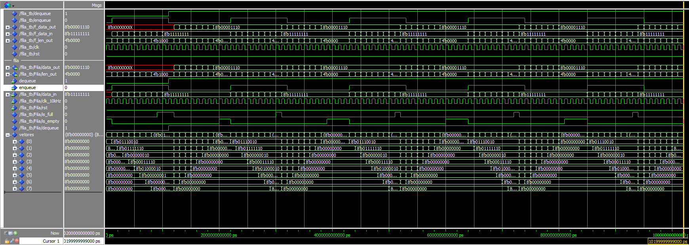
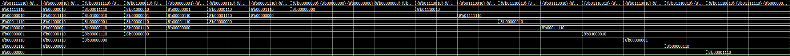
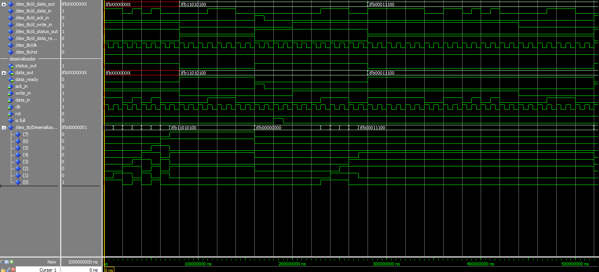

# Sistemas Digitais: Trabalho 3

Este projeto contém os módulos requisitados no trabalho, seus devidos scripts de execução e os testes.
Os módulos presentes são um Deserializador, funcionando a 100Khz, uma Fila, funcionando a 10kHz, e um Top, funcionando a 1Mhz.

## Arquivos

- `Deserializador.vhd`: Recebe bits individuais com a finalidade de concatená-los em bytes.

- `Deserializador_tb.vhd`: Testbench do módulo Deserializador.
  
- `Fila.vhd`: Implementa uma fila síncrona FIFO com operações de enqueue e dequeue.

- `Fila_tb.vhd`: Testbench do módulo Fila.
  
- `Top.vhd`: Entidade principal que integra os dois módulos acima.
  
- `tb.vhd`: Testbench completo para simular o sistema.
  
- `sim.do`: Script para compilação dos arquivos e execução dos mesmos.

- `sim_des.do`: Script para compilação dos arquivos e execução para teste individual do módulo Deserializador.

- `sim_fila.do`: Script para compilação dos arquivos e execução para teste individual do módulo Fila.

- `wave_des_tb.do`: Script para configuração da exibição das ondas na simulação do módulo Deserializador.

- `wave_des_tb.do`: Script para configuração da exibição das ondas na simulação do módulo Fila.

## Testbench Fila

Funcionando e tentando adicionar caso cheio:

O tamanho para em 8 (mesmo o testbench tentando adicionar mais), e ignora os inputs seguintes. Por exemplo, como pode ser visto no data_in e na lista de vetores, como ilustrado,
o testbench tenta dar enqueue em "11111111", porém como ele está cheio, não é aceito.

Enqueue e Dequeue:

## Testbench Deserializador

.png)

Exemplo do Deserializador funcionando no caso bom.

Exemplo do Deserializador funcionando no caso rum.

## Resultados Obtidos

Consegui construir o módulo da Fila e do Deserializador e seus respectivos testbenches com sucesso. Porém na hora de integrá-los no Top, os módulos não se comportaram como o esperado, logo o arquivo resultante
esta aquém das expectativas. Além disso, os módulos individualmente se comportam corretamente.

## Como rodar a simulação

Para rodar este projeto, você deve utilizar a versão VHDL-2008.

Utilize o `sim.do`(`sim_des_tb.do` ou `sim_fila_tb.do`) desejado para testar ou os módulos individualmente ou o `sim.do` padrão para rodar o tb do Top.
